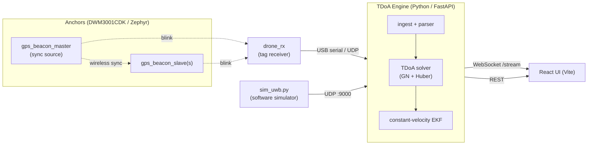

# Drone_L_RL

Indoor **UWB localization** and (planned) **RL-driven obstacle avoidance** for a
sub-250 g quadrotor. Anchors built on Nordic **DWM3001CDK** boards (nRF52833 +
DW3000 UWB) running **Zephyr RTOS** stream timing data to a **Python TDoA
engine**, which solves a live 3-D pose and publishes it over WebSocket to a
**React UI**.

The fastest way to see it work needs **no hardware** — run the engine, the
software simulator, and the UI together (see [Quick Start B](#quick-start-b--no-hardware-simulation-stack)).

## What works today vs. planned

| Area | Status | Where |
|------|--------|-------|
| UWB TDoA solver + EKF (3-D pose) | ✅ Working | `TDoA_Engine/engine/` |
| Software simulator (no hardware) | ✅ Working | `TDoA_Engine/tools/sim/` |
| Live visualization UI | ✅ Working | `TDoA_Engine/ui/` |
| Anchor sync-beacon firmware | ✅ Bring-up | `firmware/boards/dwm3001cdk/dev_firmware/gps_beacon*` |
| Drone-side UWB receiver firmware | 🚧 In progress | `firmware/boards/dwm3001cdk/dev_firmware/drone_rx` |
| 5-minute sync/dropout verification | ✅ Working | `scripts/uwb_verify_*`, `docs/uwb_verification_workflow.md` |
| RL obstacle avoidance | 📋 Planned | `docs/indoor_drone_final_project_plan.md` |
| Onboard fusion / flight stack | 📋 Planned | (Jetson + PX4, see plan) |

## How the pieces fit together



See **[`docs/ARCHITECTURE.md`](docs/ARCHITECTURE.md)** for the full data flow,
the firmware↔engine packet contract, and the solver pipeline.

## Repository layout

| Path | Contents |
|------|----------|
| `firmware/` | Zephyr apps and board assets for DWM3001CDK (samples under `boards/dwm3001cdk/dev_firmware/`) |
| `TDoA_Engine/` | Python localization engine (`engine/`), software simulator (`tools/sim/`), React UI (`ui/`) |
| `scripts/` | Zephyr setup/flash helpers and the UWB verification toolchain |
| `config/` | Example configs for the verification workflow |
| `docs/` | Architecture, glossary, design plan, reports, and vendor PDFs — see [`docs/README.md`](docs/README.md) |
| `.env.example` | Template for local (ROS/Docker) configuration |

## Quick Start A — Firmware (LED bring-up on hardware)

Requires the Zephyr SDK, `west`, Python 3.10+, and SEGGER J-Link tools. New to
Zephyr? Start with
[`firmware/boards/dwm3001cdk/dev_firmware/led_bringup/README.md`](firmware/boards/dwm3001cdk/dev_firmware/led_bringup/README.md).

```bash
export WEST_PYTHON=$(which python)
west build -b nrf52833dk/nrf52833 \
  firmware/boards/dwm3001cdk/dev_firmware/led_bringup \
  -d build/led_bringup -p always -- -DPython3_EXECUTABLE="$WEST_PYTHON"
west flash -r jlink -d build/led_bringup
```

Substitute the app path and build dir to build any other sample. See
[`firmware/README.md`](firmware/README.md) for the full sample list.

## Quick Start B — No-hardware simulation stack

This runs the entire localization pipeline on your laptop. Requires Python 3.10+
and Node.js 18+. Open three terminals at the repo root:

```bash
# 1. Engine (REST on :8000, pose WebSocket at ws://127.0.0.1:8000/stream)
python -m pip install -r TDoA_Engine/requirements.txt
uvicorn TDoA_Engine.engine.service.http_api:app --host 127.0.0.1 --port 8000

# 2. Simulator (feeds anchor measurements to the engine over UDP :9000)
python TDoA_Engine/tools/sim/sim_uwb.py --cfg TDoA_Engine/tools/sim/example_circle.yaml

# 3. UI (Vite dev server on http://127.0.0.1:5173)
cd TDoA_Engine/ui && npm install && npm run dev
```

Full details, configuration, and troubleshooting live in
[`TDoA_Engine/README.md`](TDoA_Engine/README.md).

## Testing

- **Engine (Python):** `python -m unittest discover TDoA_Engine/engine/tests`
- **Firmware:** currently sample-driven (build + flash + inspect `printk` logs);
  add Zephyr Twister (`west twister`) when introducing structured tests.

## Contributing

- **Coding style & conventions:** see [`AGENTS.md`](AGENTS.md).
- **Commits:** Conventional Commits (`feat:`, `fix:`, `docs:`), subject ≤ 72 chars.
- **PRs:** include a summary, affected paths, and validation evidence (test
  output, flash/console logs); note hardware assumptions (board, pins, runners).

## Security & configuration

- Never commit secrets; `.env` is git-ignored (copy from `.env.example`).
- Large vendor SDK blobs are ignored via `.gitignore`.
- Engine logs and calibration files under `TDoA_Engine/engine/logs/` are local
  artifacts — treat them as disposable unless explicitly needed.

## Documentation map

- [`docs/README.md`](docs/README.md) — index of every doc in the repo
- [`docs/ARCHITECTURE.md`](docs/ARCHITECTURE.md) — system architecture & data flow
- [`docs/GLOSSARY.md`](docs/GLOSSARY.md) — UWB/localization terms (TDoA, TWR, EKF, GDOP, …)
- [`docs/indoor_drone_final_project_plan.md`](docs/indoor_drone_final_project_plan.md) — goals, requirements, timeline
- [`docs/uwb_verification_workflow.md`](docs/uwb_verification_workflow.md) — 5-minute sync/dropout verification runs
