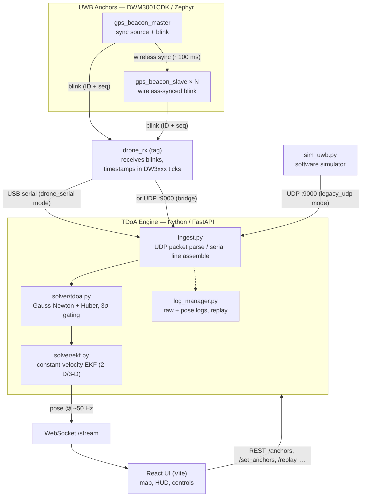

# Architecture & Data Flow

This document describes how the Drone_L_RL localization system fits together —
from the UWB anchor firmware, through the Python TDoA engine, to the React UI —
and documents the firmware↔engine wire contracts so the two halves can be
developed independently. For term definitions (TDoA, TWR, EKF, GDOP, NLOS,
anchor/tag/blink, ppm drift, …) see [`GLOSSARY.md`](GLOSSARY.md).

## 1. System overview



## 2. Pipeline stages

1. **Anchors emit timing.** A master beacon broadcasts wireless sync; slaves
   correct their clocks against it. Every anchor periodically transmits a
   *blink* (its ID + sequence number). See `firmware/README.md` for the sample
   apps (`gps_beacon_master`, `gps_beacon_slave`, and the `*_verify` variants).
2. **The drone/tag receives blinks** and records a receive timestamp in DW3xxx
   ticks (≈ 63.8976 GHz). `drone_rx` is the in-progress receiver.
3. **The engine ingests epochs** — one epoch groups the per-anchor observations
   for a single sequence number. Two ingest modes exist (see §3).
4. **The TDoA solver** converts time-difference-of-arrival into a position via
   weighted Gauss-Newton with a Huber robust loss, dropping outliers with 3σ
   gating. A 3-D solve needs ≥ 4 anchors (`dim + 1`).
5. **The EKF** (constant-velocity model) smooths the per-epoch fix and produces
   position + velocity + covariance.
6. **Publication.** Each accepted pose is broadcast on the `/stream` WebSocket
   (~50 Hz) and optionally logged for replay.

## 3. Ingest modes

The engine selects its input source via `TDOA_INGEST_MODE` (see §6).

| Mode | Source | Format | Used by |
|------|--------|--------|---------|
| `legacy_udp` (default) | UDP datagrams on `TDOA_UDP_HOST:TDOA_UDP_PORT` (`127.0.0.1:9000`) | Binary packet (§4) | `sim_uwb.py`, any UDP bridge |
| `drone_serial` | Serial port `TDOA_SERIAL_PORT` | `DRONE:` text console lines (§5) | `drone_rx` firmware over USB |

Both modes normalize into the same **epoch dict** before solving:

```jsonc
{
  "tag_tx_seq": 123,            // sequence number for this epoch
  "t_tx_tag": 12.34,            // epoch time (seconds)
  "anchors": [
    { "id": "A1", "t_obs_ticks": 8.1e11, "q": 0.0225,
      "cir_snr_db": 18.0, "nlos_score": 0.0 }
  ],
  "clock": { "tick_hz": 63897600000.0, "mode": "wireless_sync" },
  "observation_kind": "absolute_rx",  // or "toa"
  "source": "legacy_udp"              // or "drone_serial"
}
```

## 4. Binary UDP packet contract (`legacy_udp`)

Defined in `TDoA_Engine/engine/ingest.py` (`parse_packet`). All fields are
little-endian. This is the contract the simulator emits and that firmware (or a
host-side bridge) must match.

**Header** — struct format `<HHI d B`:

| Field | Type | Notes |
|-------|------|-------|
| `magic` | `uint16` | `0x01D3` |
| `len` | `uint16` | Payload length = `len(packet) - 4` |
| `seq` | `uint32` | Tag transmit sequence number |
| `t_tx_tag_s` | `float64` | Tag transmit time, seconds |
| `n_anc` | `uint8` | Number of anchor entries that follow |

**Per-anchor entry** (`n_anc` of these) — struct format `<B Q f f f`:

| Field | Type | Notes |
|-------|------|-------|
| `anchor_id` | `uint8` | Becomes `"A{id}"` (e.g. `1 → "A1"`) |
| `t_rx_ticks` | `uint64` | Receive timestamp in DW3xxx ticks |
| `q_ns2` | `float32` | Measurement variance hint (ns²) |
| `snr_db` | `float32` | CIR SNR (dB), used for weighting |
| `nlos_score` | `float32` | NLOS likelihood [0..1], down-weights the anchor |

> The on-disk replay log uses either this exact binary framing (legacy magic) or
> a length-prefixed JSON record (`normalized_epoch_v1`); `iter_logged_epochs`
> auto-detects which.

## 5. Serial console contract (`drone_serial`)

In `drone_serial` mode the engine parses text lines emitted by `drone_rx`
(`DroneSerialEpochAssembler` in `ingest.py`). Recognized line types:

| Prefix | Meaning |
|--------|---------|
| `DRONE: SYNC master=<id> seq=<n> t1=<ticks> ts=<ticks>` | Master/drone clock sync pair (used to fit `α`, `β`) |
| `DRONE: BLINK id=<beacon> seq=<n> slot=<s> flags=<f> ts=<ticks>` | A received anchor blink for sequence `n` |
| `DRONE: CAL_EDGE a=A.. b=A.. sample=.. dist_m=.. valid=.. path_ticks=.. seq=..` | Inter-anchor TWR range sample (auto-geometry) |
| `DRONE: CAL_GRAPH status=.. roster_hash=.. edges=.. anchors=.. seq=..` | Completed calibration graph announcement |
| `DRONE: CAL_READY state=.. seq=..` | Calibration state transition |

The assembler unwraps 40-bit timestamps, fits the master→drone clock relation
(`t_drone = α·t_master + β`) from consecutive `SYNC` events, then finalizes a
superframe into an epoch once enough blinks (default ≥ 3) are collected. `CAL_*`
lines feed boot-time auto-geometry (estimating the anchor layout from inter-anchor
TWR via metric MDS — see `engine/autocal.py`).

## 6. Engine configuration

All engine knobs are environment variables read in `TDoA_Engine/engine/config.py`
(defaults shown):

| Variable | Default | Purpose |
|----------|---------|---------|
| `TDOA_INGEST_MODE` | `legacy_udp` | `legacy_udp` or `drone_serial` |
| `TDOA_UDP_HOST` / `TDOA_UDP_PORT` | `127.0.0.1` / `9000` | UDP ingest endpoint |
| `TDOA_SERIAL_PORT` | _(empty)_ | Serial device for `drone_serial` mode |
| `TDOA_SERIAL_BAUDRATE` | `115200` | Serial baud rate |
| `TDOA_HTTP_PORT` | `8000` | REST/WebSocket port |
| `TDOA_WS_URL` | `ws://127.0.0.1:8000/stream` | Pose stream URL (clients) |
| `TDOA_TICK_HZ` | `63897600000.0` | DW3xxx timestamp resolution |
| `TDOA_CALIBRATION_FILE` | `engine/logs/calibration.json` | Persisted anchor/clock calibration |
| `TDOA_LOG_ROOT` | `engine/logs` | Raw + pose log directory |
| `TDOA_MAX_RESIDUAL_RMS_NS` | `500.0` | Reject solves above this residual |
| `TDOA_MAX_GDOP` | `50.0` | Reject solves above this GDOP |
| `TDOA_AUTO_LAYOUT_RMS_GATE_M` | `0.25` | Auto-geometry acceptance gate (RMS) |
| `TDOA_AUTO_LAYOUT_MAX_ABS_GATE_M` | `0.45` | Auto-geometry acceptance gate (max abs) |

> Note: the top-level `.env.example` covers the broader (ROS/Docker/Postgres)
> deployment environment. The engine itself only reads the `TDOA_*` variables
> above.

## 7. Pose output (WebSocket `/stream`)

Each accepted pose is published as JSON:

```jsonc
{
  "ok": true,
  "t": 12.36,
  "tag_tx_seq": 124,
  "pose": { "x": 2.01, "y": 1.48, "z": 1.19 },
  "vel":  { "x": 0.03, "y": -0.01, "z": 0.00 },
  "cov":  [[...], [...], [...]],          // position covariance
  "status": {
    "anchors_used": 4,
    "residual_rms_ns": 1.5,
    "gdop": 1.8,
    "outliers": 0,
    "ref_anchor": "A1",
    "anchor_order": ["A1", "A2", "A3", "A4"],
    "layout_source": "manual"             // or "auto"
  }
}
```

The full REST surface (`/healthz`, `/anchors`, `/set_anchors`,
`/validate_anchor_layout`, `/start_log`, `/stop_log`, `/replay`) is documented in
[`../TDoA_Engine/README.md`](../TDoA_Engine/README.md#engine-api-reference).

## 8. Key source files

| File | Responsibility |
|------|----------------|
| `TDoA_Engine/engine/ingest.py` | Packet/serial parsing, epoch assembly, clock sync |
| `TDoA_Engine/engine/solver/tdoa.py` | TDoA Gauss-Newton solver with Huber loss |
| `TDoA_Engine/engine/solver/ekf.py` | Constant-velocity EKF |
| `TDoA_Engine/engine/autocal.py` | Anchor-layout estimation from TWR (MDS), clock fits |
| `TDoA_Engine/engine/service/http_api.py` | FastAPI app: ingest tasks, REST, WebSocket |
| `TDoA_Engine/engine/service/log_manager.py` | Raw + pose logging and replay framing |
| `TDoA_Engine/tools/sim/sim_uwb.py` | Software simulator (emits the §4 packet) |
| `TDoA_Engine/ui/src/` | React UI (map view, HUD, controls) |
